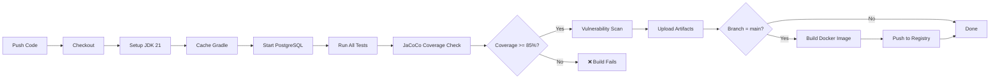

# Testing Guide - School Fee App

## 📋 Overview

This guide explains how to run tests locally and in CI/CD for the school fee application.

---

## 🎯 Quick Start

### Run Tests Locally (Fast - No Database)

```bash
cd backend
./gradlew test
```

This runs **unit tests only** with mocked repositories (~30 seconds).

---

### Run Tests with Real Database (Like CI/CD)

#### Option 1: Use Helper Script (Recommended)

```bash
# Make script executable (first time only)
chmod +x run-tests.sh

# Run all tests with PostgreSQL
./run-tests.sh all

# Run only integration tests
./run-tests.sh integration

# Run specific test class
./run-tests.sh specific com.fee.app.schoolfeeapp.auth.service.impl.UserManagementServiceIntegrationTest
```

The script automatically:
- ✅ Starts PostgreSQL container on port 5433
- ✅ Waits for database readiness
- ✅ Sets environment variables
- ✅ Runs tests
- ✅ Opens coverage report (macOS)
- ✅ Stops database when done

#### Option 2: Manual Setup

```bash
# 1. Start test database
docker-compose -f docker-compose.test.yml up -d

# 2. Wait for database to be ready (check logs)
docker logs -f school-fee-test-db

# 3. Set environment variables
export SPRING_R2DBC_URL=r2dbc:postgresql://localhost:5433/school_fee_test
export SPRING_R2DBC_USERNAME=test_user
export SPRING_R2DBC_PASSWORD=test_pass

# 4. Run tests
./gradlew clean test jacocoTestReport

# 5. Stop database when done
docker-compose -f docker-compose.test.yml down
```

---

## 🔄 Test Execution Environments

| Environment | Command | Database | Automatic? |
|------------|---------|----------|-----------|
| **Local (your machine)** | `./gradlew test` | Mocked (in-memory) | ❌ Manual |
| **Local with Docker** | `./run-tests.sh all` | PostgreSQL 16 | ❌ Manual |
| **CI/CD (GitHub Actions)** | Auto on push/PR | PostgreSQL 16 | ✅ Automatic |

---

## 📊 Test Types

### Unit Tests (`*Test.java`)
- **Speed**: Fast (~30 seconds)
- **Database**: Mocked repositories
- **Purpose**: Business logic, validation, error handling
- **Run**: `./gradlew test`

**Examples:**
- `UserManagementServiceImplTest.java`
- `AuthServiceTest.java`
- `GuardianLinkingServiceTest.java`

### Integration Tests (`*IntegrationTest.java`)
- **Speed**: Medium (~2-5 minutes with DB)
- **Database**: Real PostgreSQL or mocked
- **Purpose**: Service orchestration, reactive streams, transactions
- **Run**: `./gradlew test --tests "*IntegrationTest"`

**Examples:**
- `UserManagementServiceIntegrationTest.java`
- `AuthControllerIntegrationTest.java`

---

## 🚀 CI/CD Pipeline Behavior

### When Does It Run?

The GitHub Actions workflow (`.github/workflows/commit-stage.yml`) runs **automatically** when:

1. **Push to main branch**
   ```bash
   git push origin main
   # → Triggers full pipeline
   ```

2. **Push to develop branch**
   ```bash
   git push origin develop
   # → Triggers full pipeline
   ```

3. **Pull Request to main**
   ```bash
   gh pr create --base main
   # → Triggers build + tests (no deployment)
   ```

### What Happens in CI/CD?



**Steps:**
1. ✅ Checkout code
2. ✅ Setup Java 21
3. ✅ Cache Gradle dependencies
4. ✅ Start PostgreSQL 16 service container
5. ✅ Run all tests (unit + integration)
6. ✅ Enforce JaCoCo coverage thresholds (85%)
7. ✅ Upload test results & coverage reports
8. ✅ Vulnerability scanning (Anchore)
9. ✅ Build Docker image (main branch only)
10. ✅ Push to GitHub Container Registry (main branch only)

---

## 🛠️ Available Commands

### Gradle Commands

```bash
# Run all tests
./gradlew test

# Run with coverage
./gradlew test jacocoTestReport

# Enforce coverage thresholds
./gradlew build jacocoTestCoverageVerification

# Run specific test class
./gradlew test --tests UserManagementServiceImplTest

# Run specific test method
./gradlew test --tests "UserManagementServiceImplTest.shouldCreateParent"

# Run only integration tests
./gradlew test --tests "*IntegrationTest"

# Skip tests (not recommended!)
./gradlew build -x test
```

### Helper Script Commands

```bash
./run-tests.sh unit          # Unit tests only
./run-tests.sh integration   # Integration tests with DB
./run-tests.sh all           # All tests with DB
./run-tests.sh specific <class>  # Specific test class
./run-tests.sh db-start      # Start test database
./run-tests.sh db-stop       # Stop test database
./run-tests.sh help          # Show help
```

---

## 📝 Recommended Workflow

### Before Committing

```bash
# 1. Quick check (unit tests only)
./gradlew test

# 2. Full check with coverage
./gradlew build jacocoTestCoverageVerification
```

### Before Pushing to Main

```bash
# Run all tests with real database (mimics CI/CD)
./run-tests.sh all
```

### After Pushing

CI/CD runs automatically - no manual action needed! Monitor at:
```
https://github.com/olanrewajufcb/school-fee-app/actions
```

---

## 🔍 Troubleshooting

### Tests Fail Locally but Pass in CI/CD

**Cause**: Your local tests use mocked repositories, while CI uses real PostgreSQL.

**Solution**: Run tests with real database locally:
```bash
./run-tests.sh all
```

### Database Connection Errors

**Error**: `Connection refused: localhost/127.0.0.1:5433`

**Solution**:
```bash
# Check if test database is running
docker ps | grep school-fee-test-db

# If not running, start it
./run-tests.sh db-start

# Or restart completely
./run-tests.sh db-stop
./run-tests.sh all
```

### Port Already in Use

**Error**: `Port 5433 is already in use`

**Solution**:
```bash
# Find process using port 5433
lsof -i :5433

# Kill it or change port in docker-compose.test.yml
```

### Slow Builds

**Problem**: Every build takes 5+ minutes

**Solution**: Gradle caching is now enabled in CI/CD. Local builds benefit from:
```bash
# Don't clean unnecessarily
./gradlew test  # Not ./gradlew clean test

# Use incremental builds
./gradlew build  # Reuses previous compilation
```

---

## 📈 Coverage Reports

After running tests, view coverage:

```bash
# Generate HTML report
./gradlew jacocoTestReport

# Open on macOS
open build/reports/jacoco/test/html/index.html

# Open on Linux
xdg-open build/reports/jacoco/test/html/index.html
```

**Coverage Thresholds:**
- Instructions: ≥ 85%
- Branches: ≥ 80%
- Lines: ≥ 85%

If coverage drops below these thresholds, CI/CD will **fail**.

---

## 🎓 Key Takeaways

1. **CI/CD is automatic** - You don't need to trigger it
2. **Run tests locally before pushing** - Catch issues early
3. **Use helper script for convenience** - `./run-tests.sh all`
4. **Real database testing is optional locally** - But recommended before major releases
5. **Coverage enforcement happens in CI/CD** - Maintain ≥ 85% coverage

---

## 📚 Additional Resources

- [CI/CD Configuration](../.github/workflows/commit-stage.yml)
- [Testcontainers Documentation](https://www.testcontainers.org/)
- [JaCoCo Documentation](https://www.jacoco.org/jacoco/trunk/doc/)
- [Spring Boot Testing](https://docs.spring.io/spring-boot/docs/current/reference/html/features.html#features.testing)
